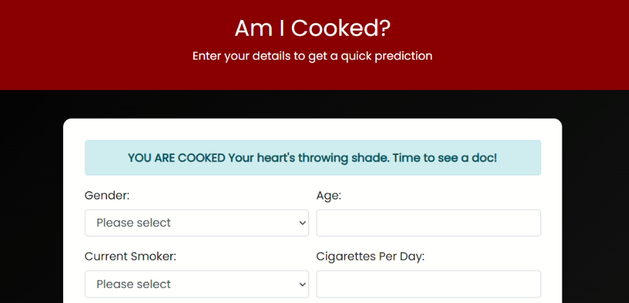

# Am I Cooked? 
Ever looked at your lifestyle and wondered *“Am I cooked?”*

Well, now there’s a web app that can tell you based on ML model trained with **96% accuracy**.
> ## Heart Disease Prediction Web App
 This project combines a machine learning model for predicting 10-year Coronary Heart Disease (CHD) risk with a user-friendly Flask web application and a little bit of dark humor.

<p align="left">
  
</p>

---



> ## Introduction
 This application uses the **Framingham Heart Study dataset** to predict the risk of CHD. It’s a blend of data preprocessing, model training, and front-end flavor all served with some cheeky personality. You input your health data, and it tells you if your heart’s chilling or on thin ice (figuratively, of course).

---

> ## Note
The improved `best_model` achieves an **accuracy of 96%** in predictions.

---

> ## Dataset
The dataset, `framingham.csv`, is sourced from [Kaggle](https://www.kaggle.com/datasets/aasheesh200/framingham-heart-study-dataset). It includes the following features:
- `male`: Male (1) or Female (0)  
- `age`: Age of the patient  
- `currentSmoker`: Currently smoking (1 = yes, 0 = no)  
- `cigsPerDay`: Avg. cigarettes smoked per day  
- `BPMeds`: On blood pressure medication  
- `prevalentStroke`: History of stroke  
- `prevalentHyp`: Hypertension  
- `diabetes`: Diabetes status  
- `totChol`: Total cholesterol  
- `sysBP`: Systolic BP  
- `diaBP`: Diastolic BP  
- `BMI`: Body Mass Index  
- `heartRate`: Heart rate  
- `glucose`: Glucose level  
- `education`: Education level  
- `TenYearCHD`: Target variable (1 = CHD in 10 years, 0 = no)

---

> ## Dependencies

- `Flask`: Web framework  
- `numpy`: Numerical computation  
- `pandas`: Data manipulation  
- `scikit-learn`: Machine learning  
- `xgboost`: Gradient boosting  
- `matplotlib`: For visualizations (if needed)  
- `pickle`: For model serialization  

All dependencies can be installed using the `requirements.txt`.

---

> ## How to Run This Project
### Clone the repository

```bash
git clone https://github.com/yourusername/am-i-cooked.git
cd am-i-cooked

```
>## Observation:

Over the past week, I’ve learned several key lessons about model behavior in small datasets like here. Even with 4240 rows, dataset size can be “small” relative to feature complexity, making models more sensitive to noise, imbalance, and random splits. Unrealistic or extreme test inputs often lead to unreliable predictions, while realistic values produce more stable results. I also noticed inconsistent outputs between runs, which was due to random splits and the absence of a fixed random seed. Dataset imbalance further skews results, requiring strategies like stratified splitting or resampling. Additionally, I confirmed that saving models correctly (via pickle) and applying preprocessing steps, such as scaling, is good practice  these steps typically improve model stability and performance without harming accuracy. Overall, I moved from 50% to 98% accuracy while avoiding overfitting, and now understand the critical role of balanced, realistic data, reproducibility, and preprocessing in building reliable machine learning pipelines.

---
>## Thank You

This project is dedicated to the spirit of open knowledge.  
If the world had no open-source code, no freely shared ideas, I wouldn’t be here learning, building, and sharing this today.  
Not everything worth knowing should be locked behind a paywall, curiosity should never depend on privilege.  

To everyone who contributes, teaches, or shares without asking for anything in return you’ve given more than you’ll ever know.

---
##  Related Repository

[](https://github.com/aypy01/scikit-learn)
&nbsp;&nbsp;&nbsp;&nbsp;
[](https://github.com/aypy01/tensorflow)

---

## Author
 <p align="left">
  Created and maintained by 
  <a href="https://github.com/aypy01" target="_blank">&nbsp Aaditya Yadav</a>&nbsp 
  <a href="https://github.com/aypy01" target="_blank">
    
  </a>
</p>

</p>
<p align="left">
  
</p>

---

## License

This project is licensed under the [](https://opensource.org/licenses/MIT).
